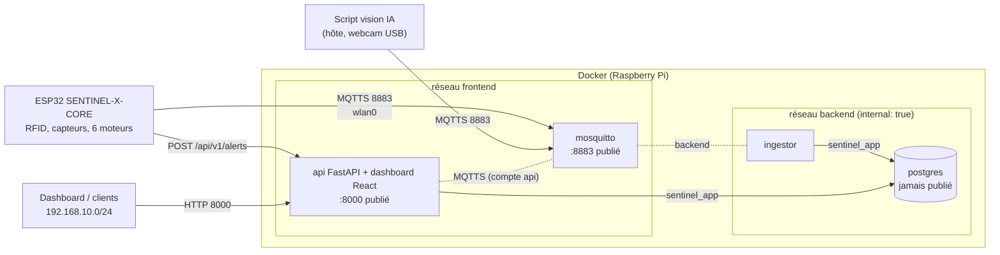

# SENTINEL-X — Serveur local (Raspberry Pi 3 B+)

Stack Docker-Compose **légère, sécurisée et reproductible** du « PC Serveur Local » de la mission SENTINEL-X.
Le module **ESP32 SENTINEL-X-CORE** (capteurs gaz, température/humidité, PIR, lecteur RFID, 6 moteurs pas-à-pas,
LED RGB, buzzer) publie en **MQTTS** vers un broker Mosquitto. Un service d'ingestion valide les messages et les écrit
dans PostgreSQL. L'**API FastAPI** expose alertes, télémétrie et badges, décide des accès RFID et envoie les commandes
moteurs et alarme.

Cible : **Raspberry Pi 3 Model B+** (1 Go de RAM, Cortex-A53), **Raspberry Pi OS Lite 64-bit (arm64)**.
Le Pi sert aussi de point d'accès Wi-Fi 2.4 GHz (`wlan0`, 192.168.10.0/24) et exécute le script de vision IA.
**Budget RAM de la stack Docker : ~450 Mo maximum.**

Documentation :
- **[docs/CONTRAT-MQTT.md](docs/CONTRAT-MQTT.md)** : contrat MQTT v2 (source de vérité ESP32 ↔ serveur) ;
- **[docs/API.md](docs/API.md)** : référence de l'API REST ([docs/openapi.json](docs/openapi.json), interface interactive sur `:8000/docs`) ;
- **tableau de bord d'analyse** (React) : `http://192.168.10.1:8000/dashboard/` (jeton `API_TOKEN`).

---

## 1. Démarrage rapide

### Prérequis

- Raspberry Pi OS Lite **64-bit** (`uname -m` → `aarch64`), accès SSH par `eth0`.
- Docker Engine ≥ 24 avec le plugin Compose v2 ([installation Debian arm64](https://docs.docker.com/engine/install/debian/)).
- `openssl` et `git` (présents par défaut sur Raspberry Pi OS).

### Installation

```bash
git clone <url-du-depot> sentinel && cd sentinel

sudo ./scripts/setup-pi.sh --dry-run    # aperçu : zram, cgroup mémoire, journald en RAM, services inutiles…
sudo ./scripts/setup-pi.sh              # puis « sudo reboot » si le script le demande

./scripts/gen-env.sh                    # .env (mots de passe aléatoires) + mosquitto/secrets/passwd (haché)
./scripts/gen-certs.sh                  # CA + certificat serveur ECDSA P-256, ca_cert.h pour le firmware
docker compose up -d --build            # premier build : quelques minutes sur le Pi 3
docker compose ps                       # les 4 services doivent passer « healthy » (~1 min)
./scripts/smoke-test.sh                 # test de bout en bout : 32 vérifications (MQTT, API, RFID)

sudo ./scripts/harden-host.sh --dry-run # aperçu du pare-feu (UFW + DOCKER-USER) et du durcissement SSH
sudo ./scripts/harden-host.sh           # garder sa session SSH ouverte, confirmer depuis une 2e session
```

Tous les scripts sont **idempotents** : on peut les relancer sans risque.

---

## 2. Architecture



| Service | Image | Réseaux | Port publié | Utilisateur | Limite RAM |
|---|---|---|---|---|---|
| `mosquitto` | `eclipse-mosquitto:2.1.2-alpine` | frontend, backend | **8883/tcp** (MQTTS) | UID de l'hôte (`PUID`) | 32 Mo |
| `postgres` | `postgres:17.11-alpine3.24` | backend | — | `70` (postgres) | 160 Mo |
| `ingestor` | build `./ingestor` (`python:3.13.16-alpine3.24`) | backend | — | `10001` | 64 Mo |
| `api` | build `api/Dockerfile` (FastAPI + dashboard React compilé, `python:3.13.16-alpine3.24`) | frontend, backend | **8000/tcp** | `10002` | 128 Mo |

- **backend** est `internal: true`, donc sans route vers l'extérieur. Mosquitto et l'API y sont aussi rattachés pour joindre la base et l'ingestor.
- **frontend** porte les deux seuls ports publiés. **PostgreSQL n'est jamais publié.**
- Aucun port 1883 : MQTT en clair n'existe pas.

### Flux de données

1. L'ESP32 publie `sentinel/telemetry` (2 s) et `sentinel/alerts` en TLS, avec le compte `esp32` limité par ACL. Les alertes peuvent aussi passer par `POST /api/v1/alerts` (jeton d'appareil).
2. L'`ingestor` s'abonne, valide chaque JSON (types, bornes, énumérations), ajoute `received_at`, puis écrit **par lots** dans PostgreSQL. Un message invalide est journalisé et ignoré, sans plantage. En cas de panne de la base, l'écriture est retentée avec backoff.
3. **RFID** : l'ESP32 publie `sentinel/access`. L'API vérifie le badge en base, journalise le passage et répond sur `sentinel/access/response` (ouverture du sas). Un refus crée une alerte `UNAUTHORIZED_ACCESS`.
4. **Commandes** : `POST /api/v1/commands` (moteurs, arrêt d'urgence, alarme) est validé puis publié sur `sentinel/commands` et journalisé.
5. Le script IA publie `sentinel/vision/events` (compte `vision`) et lit l'historique par l'API (`GET /api/v1/telemetry`). La base n'est jamais publiée.

---

## 3. Budget mémoire

Mesures **réelles** par conteneur (`docker stats --no-stream`) : stack démarrée, après le smoke test et une rafale de
2000 messages. Les mesures ont été prises sur un hôte **linux/arm64** (Docker Desktop, mêmes images et binaires arm64
qu'au Pi). Les lignes OS et démon Docker sont des **estimations**, à remplacer par les valeurs de `./scripts/status.sh` sur le Pi.

| Poste | Limite / réservation | Mesuré | Remarques |
|---|---:|---:|---|
| RAM physique Pi 3 B+ | 1024 Mo | — | |
| GPU (`gpu_mem=16`, Pi sans écran) | 16 Mo | — | réglé par `setup-pi.sh` (défaut 76 Mo) |
| OS Lite (noyau, systemd, sshd, hostapd, dnsmasq, chrony) | ~130 Mo | *à mesurer* | journald en RAM plafonné à 32 Mo |
| Docker Engine (dockerd + containerd + shims) | ~70 Mo | *à mesurer* | hors limites cgroup |
| `mosquitto` | 32 Mo | **2,4 Mo** | pas de persistance, file ≤ 1 Mio par client |
| `postgres` | 160 Mo | **23 Mo** | `shared_buffers=24MB`, croît avec le cache (≤ ~60 Mo attendus) |
| `ingestor` | 64 Mo | **25 Mo** | Python + paho + psycopg ; file tampon ≤ 2000 messages |
| `api` (FastAPI + uvicorn, 1 worker) | 128 Mo | **44 Mo** | pool de 4 connexions PostgreSQL + client MQTT |
| **Sous-total conteneurs** | **384 Mo** | **≈ 93 Mo** | |
| **Stack Docker complète** (moteur + conteneurs) | **≈ 454 Mo** | **≈ 165 Mo** (estimé) | budget visé : ~450 Mo ✔ |
| **Réserve pour l'IA** (pire cas : toutes limites atteintes) | **≈ 420 Mo** | — | 1024 − 16 − 130 − 454 |
| **Réserve pour l'IA** (usage mesuré) | **≈ 710 Mo** | — | |
| Swap | zram (~450 Mo compressés en RAM) | — | aucun swap sur la carte SD |

À vérifier sur le Pi (et à reporter dans ce tableau) :

```bash
free -m
docker stats --no-stream
./scripts/status.sh        # total stack + alerte si > 450 Mo (variable BUDGET_MB)
```

> ⚠️ Sur Raspberry Pi OS, le **cgroup mémoire** peut être désactivé : les `mem_limit` sont alors **ignorés**
> (`docker info` affiche « No memory limit support »). `setup-pi.sh` le détecte et ajoute
> `cgroup_enable=memory cgroup_memory=1` à `cmdline.txt` (redémarrage nécessaire).

Taille des images (disque, pas RAM) : mosquitto 43 Mo, python-alpine 83 Mo (couches partagées par l'ingestor et
l'API), ingestor 110 Mo. **postgres-alpine fait ~415 Mo** : c'est la plus petite image PostgreSQL officielle, et elle dépasse
l'objectif de 150 Mo. Si le disque ou la RAM manquent, voir la variante SQLite (§ 9).

---

## 4. Sécurité (résumé)

| Mesure | Mise en œuvre |
|---|---|
| Aucun secret dans Git | `.env`, `mosquitto/secrets/*`, `mosquitto/certs/*` gitignorés ; `.env.example` versionné. `gen-env.sh` génère des mots de passe aléatoires de 32 caractères. |
| Mots de passe MQTT | hachés par `mosquitto_passwd -U` (PBKDF2-SHA512) dans un conteneur sans réseau ; jamais passés en argument de commande. |
| TLS | CA interne + certificat serveur **ECDSA P-256**. **TLS 1.2 minimum.** Suites ECDHE-ECDSA compatibles mbedTLS de l'ESP32 (AES-GCM, ChaCha20). RSA, CBC-SHA1 et TLS 1.1 refusés (vérifié). |
| Authentification / ACL | `allow_anonymous false`, un compte par composant, ACL au topic près (cf. contrat). |
| API | jetons Bearer distincts (opérateur / appareil), comparés en temps constant ; le jeton d'appareil ne permet que `POST /api/v1/alerts`. Validation stricte des entrées (422), commandes moteurs bornées (`motor_id`, `speed_rpm`…) avant publication, journal des commandes et des accès. |
| Base de données | superuser réservé à l'init et aux sauvegardes ; `sentinel_app` (SELECT/INSERT/UPDATE) et `sentinel_ro` (SELECT, `default_transaction_read_only`) ; `statement_timeout` ; `CONNECT` révoqué pour `PUBLIC`. |
| Conteneurs | non-root, `cap_drop: [ALL]` (aucune capacité réajoutée), `no-new-privileges`, `read_only: true` + `tmpfs`, `pids_limit`, limites CPU/RAM, images épinglées (jamais `latest`), aucun socket Docker monté. |
| Réseaux | `backend` interne ; seuls 8883 et 8000 publiés. |
| Pare-feu hôte | UFW deny incoming. Ouvertures depuis `wlan0`/192.168.10.0/24 uniquement (SSH, 8883, API, DHCP/DNS/NTP du point d'accès), SSH limité depuis `eth0`. **Docker contourne UFW** pour les ports publiés : `harden-host.sh` ajoute des règles dans la chaîne `DOCKER-USER` (`/etc/ufw/after.rules`). |
| SSH | clés uniquement, root interdit, `MaxAuthTries 3`. Drop-in `01-…` prioritaire sur un éventuel `50-cloud-init.conf`. Retour arrière automatique sans confirmation sous 120 s. |
| Groupe `docker` | `harden-host.sh` liste ses membres : appartenir à ce groupe revient à être root. N'y ajouter personne sans nécessité. |
| Montages | syntaxe longue avec `create_host_path: false` : si un certificat ou un secret manque, le démarrage échoue explicitement au lieu de créer un dossier vide. |

---

## 5. Tester MQTT en TLS (`mosquitto_pub` / `mosquitto_sub`)

Sur le Pi : `sudo apt install mosquitto-clients`. Sinon, utiliser l'image du broker (voir plus bas). Charger les mots de passe :

```bash
set -a; . ./.env; set +a
CA=mosquitto/certs/ca.crt
```

Écouter tout le trafic (compte `api`) :

```bash
mosquitto_sub -h 192.168.10.1 -p 8883 --cafile $CA -u api -P "$MQTT_PASS_API" -t 'sentinel/#' -v
```

Publier une télémétrie, puis un passage de badge (compte `esp32`) :

```bash
mosquitto_pub -h 192.168.10.1 -p 8883 --cafile $CA -u esp32 -P "$MQTT_PASS_ESP32" -t sentinel/telemetry -q 0 \
  -m "{\"node_id\":\"SENTINEL-X-CORE\",\"timestamp\":$(date +%s),\"metrics\":{\"temperature_celsius\":23.4,\"humidity_percent\":48.0,\"gas_raw_ppm\":215,\"presence_detected\":false}}"

mosquitto_pub -h 192.168.10.1 -p 8883 --cafile $CA -u esp32 -P "$MQTT_PASS_ESP32" -t sentinel/access -q 1 \
  -m '{"node_id":"SENTINEL-X-CORE","card_uid":"A3:5F:B2:1C","door_id":"AIRLOCK_MAIN"}'
# -> réponse de l'API visible sur sentinel/access/response (mosquitto_sub ci-dessus)
```

Envoyer une commande (passe par l'API, qui valide et publie sur `sentinel/commands`) :

```bash
curl -X POST http://192.168.10.1:8000/api/v1/commands -H "Authorization: Bearer $API_TOKEN" \
  -H 'Content-Type: application/json' -d '{"action":"EMERGENCY_STOP_ALL"}'
```

Contrôles négatifs attendus :

```bash
mosquitto_pub -h 192.168.10.1 -p 8883 --cafile $CA -t test -m x            # refusé : pas d'anonyme
mosquitto_pub -h 192.168.10.1 -p 1883 -t test -m x                          # refusé : pas de port 1883
openssl s_client -connect 192.168.10.1:8883 -tls1_1 </dev/null              # refusé : TLS < 1.2
openssl s_client -connect 192.168.10.1:8883 -CAfile $CA -tls1_2 </dev/null  # « Verify return code: 0 (ok) »
```

Sans `mosquitto-clients`, via l'image du broker (réseau Docker interne, hôte `mosquitto`) :

```bash
docker run --rm --network sentinel_frontend \
  --mount type=bind,source="$PWD/$CA",target=/ca.crt,readonly eclipse-mosquitto:2.1.2-alpine \
  mosquitto_sub -h mosquitto -p 8883 --cafile /ca.crt -u api -P "$MQTT_PASS_API" -t 'sentinel/#' -v
```

### Smoke test automatisé

```bash
./scripts/smoke-test.sh                    # via le réseau Docker
./scripts/smoke-test.sh --host 192.168.10.1  # via le port publié (depuis le Pi)
```

Les 32 vérifications couvrent :
- **broker** : port 1883 absent, refus de la connexion anonyme et du mauvais mot de passe, ACL (l'ESP ne peut pas publier de commande) ;
- **télémétrie** : formats de la spec et du firmware réel (horodatage `millis()`), alertes MQTT, vision, JSON invalide journalisé ;
- **API** : `/health`, `/ready`, jetons (401), validation (422), alertes HTTP, acquittement ;
- **RFID** : badge autorisé, réponse `access_granted: true` reçue par l'ESP ; badge inconnu, refus et alerte `UNAUTHORIZED_ACCESS` ; révocation ;
- **commandes** : `CONTROL_MOTORS` reçu par l'ESP sur `sentinel/commands`, `motor_id` hors plage refusé, journalisation ;
- **base** : `sentinel_ro` ne peut pas écrire, services toujours `healthy`.

Tests unitaires :

```bash
# Validation de l'ingestor
docker run --rm --mount type=bind,source="$PWD/ingestor",target=/app,readonly -w /app \
  python:3.13.16-alpine3.24 python -m unittest -v
# API (modèles, jetons, 422) : commande dans l'en-tête de api/tests/test_api.py
```

---

## 6. Sauvegarde et restauration

```bash
./scripts/backup-db.sh                                  # ./backups/sentinel-AAAAMMJJ-HHMMSS.dump (garde les 7 derniers)
BACKUP_DIR=/media/usb/sentinel KEEP=14 ./scripts/backup-db.sh   # vers une clé USB (ménage la carte SD)
./scripts/backup-db.sh --restore backups/sentinel-20261005-120020.dump   # confirmation demandée
```

- Format `pg_dump -Fc` compressé, vérifié par `pg_restore -l` avant validation, fichiers en mode 600.
- La restauration arrête `ingestor` et `api`, puis remplace les tables (`--clean --single-transaction`) et redémarre les services. Les droits des rôles sont restaurés.
- Les rôles eux-mêmes sont créés par `db/init/02-roles.sh` lors de l'initialisation du volume.
- Sauvegarde quotidienne (crontab de l'utilisateur, à 3 h) :
  `0 3 * * * cd /home/<user>/sentinel && BACKUP_DIR=/media/usb/sentinel ./scripts/backup-db.sh >> /tmp/sentinel-backup.log 2>&1`
- À sauvegarder aussi, **hors du Pi** : `.env` et `mosquitto/certs/ca.key`. Sans eux, il faut reflasher la CA dans l'ESP.

Réinitialisation complète de la base (**destructive**) : `docker compose down -v && docker compose up -d`.

---

## 7. MCO et monitoring léger

- **Healthchecks** (toutes les 30 s) :
  - `mosquitto` : abonnement TLS réel avec un compte `healthcheck` limité à `$SYS/broker/uptime` ;
  - `postgres` : `pg_isready` en TCP ;
  - `ingestor` : fichier battement de cœur rafraîchi tant que MQTT est connecté et que la base répond ;
  - `api` : `GET /health`.
- **`restart: unless-stopped`** sur tous les services ; `depends_on: service_healthy` pour l'ordre de démarrage.
- **Logs** : pilote `json-file`, `max-size: 5m`, `max-file: 2` (10 Mo max par conteneur). Mosquitto écrit sur stdout et n'a pas de fichier de log propre. L'ingestor ne journalise que les rejets, les erreurs et une ligne de statistiques toutes les 5 min.
- **`./scripts/status.sh`** affiche l'état et la santé des conteneurs, le CPU et la RAM par conteneur, le total comparé au budget (code retour 1 si dépassé ou si un service n'est pas sain), la RAM libre de l'hôte et le swap zram, le disque, la taille des logs MQTT, le nombre de lignes par table, la taille de la base, les alertes non acquittées et l'état des boîtiers.
- **Carte SD** : pas de persistance Mosquitto, journald en RAM, zram au lieu du swap, `synchronous_commit=off`, `checkpoint_timeout=15min`, `wal_compression=on`, `vm.dirty_writeback_centisecs=1500`, checksums de données PostgreSQL (détection de corruption).

```bash
docker compose logs -f --tail 50 ingestor     # rejets / erreurs / statistiques
docker compose logs --tail 50 mosquitto       # connexions, refus d'authentification
```

---

## 8. Intégration par l'équipe

| Équipe | Ce qu'il faut récupérer |
|---|---|
| **Firmware ESP32** | `mosquitto/certs/ca_cert.h` (généré sur le Pi), `MQTT_PASS_ESP32` et `API_DEVICE_TOKEN` du `.env` (à mettre dans un `secrets.h` non versionné). **Adaptations obligatoires du firmware `04`** (TLS 8883, authentification, tampon de 1024 octets, traitement des commandes, pont diviseur du capteur MQ) : [contrat § 6](docs/CONTRAT-MQTT.md). |
| **API / Dashboard (DEV)** | [docs/API.md](docs/API.md), `http://192.168.10.1:8000/docs` et le tableau de bord `/dashboard/` (code dans `dashboard/`). Jeton `API_TOKEN`. Pour faire évoluer l'API : code dans `api/app/`, contraintes du conteneur en fin de `docs/API.md`. |
| **IA** | Historique de la télémétrie : `GET /api/v1/telemetry` (jeton `API_TOKEN`). Caméra : MQTTS vers `127.0.0.1:8883` ou `192.168.10.1:8883`, compte `vision`, CA `mosquitto/certs/ca.crt`, topic `sentinel/vision/events` ([contrat § 7](docs/CONTRAT-MQTT.md)). |

Changer un mot de passe ou un jeton : modifier la valeur dans `.env`, relancer `./scripts/gen-env.sh` (régénère `passwd`),
puis `docker compose up -d`. Pour les rôles PostgreSQL : `ALTER ROLE … PASSWORD …` via `docker compose exec postgres psql -U postgres`.

---

## 9. Variante SQLite (documentée, non activée)

À activer **uniquement si la RAM manque** (par exemple si le modèle de vision dépasse sa réserve). Gain attendu : environ 20 à 60 Mo
de RAM (le conteneur PostgreSQL disparaît) et ~415 Mo de disque.

| Aspect | PostgreSQL (actuel) | SQLite (variante) |
|---|---|---|
| Stockage | volume `pgdata` | fichier unique `/data/sentinel.db` sur un volume nommé |
| Conteneurs | postgres + ingestor | ingestor seul (module `sqlite3` de la bibliothèque standard, plus besoin de psycopg) |
| Concurrence | multi-écrivains | un seul écrivain à la fois : `PRAGMA journal_mode=WAL`, `synchronous=NORMAL`, `busy_timeout=5000` |
| Types | `timestamptz`, `jsonb`, `inet`, `IDENTITY` | `INTEGER` (epoch) ou texte ISO 8601, `TEXT` JSON (fonctions `json_*`), `TEXT`, `INTEGER PRIMARY KEY` ; mêmes `CHECK` |
| Droits | rôles `sentinel_app` / `sentinel_ro` | permissions de fichiers : volume monté en `:ro` pour les lecteurs (IA, dashboard), ouverture `file:…?mode=ro` |
| Sauvegarde | `pg_dump` | `sqlite3 sentinel.db ".backup …"` ou `VACUUM INTO` (cohérent à chaud) |
| Limites | — | pas d'accès réseau à la base (l'API doit partager le volume), écritures concurrentes API + ingestor sérialisées |

Mise en œuvre prévue (sur demande) : un fichier `docker-compose.sqlite.yml` qui retire `postgres`, un module
`ingestor/store_sqlite.py` qui reprend les mêmes requêtes avec la même validation (`validation.py` est inchangé), un
`db/sqlite/schema.sql`, et l'adaptation de `status.sh` et `backup-db.sh`. Activation par
`docker compose -f docker-compose.yml -f docker-compose.sqlite.yml up -d`.

---

## 10. Arborescence

```
.
├── docker-compose.yml          # stack durcie (4 services, 2 réseaux, 1 volume)
├── .env.example                # modèle de configuration (le vrai .env est généré, gitignoré)
├── mosquitto/
│   ├── config/mosquitto.conf   # MQTTS 8883, TLS 1.2+, sans anonyme, sans persistance
│   ├── config/acl              # droits par compte et par topic
│   ├── certs/                  # généré : ca.crt, ca.key, server.*, ca_cert.h (gitignoré)
│   └── secrets/                # généré : passwd haché (gitignoré)
├── db/init/
│   ├── 01-schema.sql           # devices, telemetry, alerts, badges, access_events, commands, vision_events
│   └── 02-roles.sh             # sentinel_app / sentinel_ro
├── ingestor/                   # MQTT -> PostgreSQL (validation, lots, reconnexion) + tests
├── api/                        # API FastAPI (app/ : routes, modèles, pont MQTT RFID/commandes) + tests
├── dashboard/                  # tableau de bord React (Vite + TS), compilé dans l'image de l'API
├── scripts/
│   ├── gen-env.sh  gen-certs.sh             # secrets et PKI
│   ├── setup-pi.sh  harden-host.sh          # préparation et durcissement de l'hôte (--dry-run)
│   ├── status.sh  backup-db.sh  smoke-test.sh
└── docs/                       # CONTRAT-MQTT.md (v2), API.md, openapi.json
```
