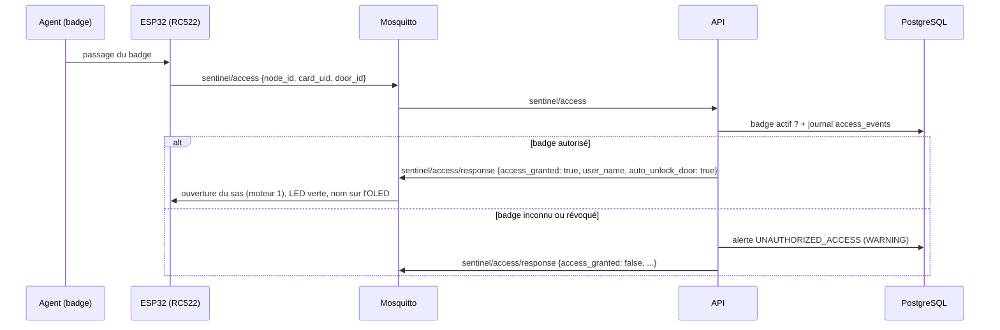

# API SENTINEL-X — référence (v2.1.0)

API REST du PC Serveur Local (Raspberry Pi) : alertes, télémétrie, contrôle d'accès RFID et commandes
superviseur du module ESP32. Code dans [`api/`](../api), schémas dans [`api/app/models.py`](../api/app/models.py).

- **Tableau de bord d'analyse** (React) : `http://192.168.10.1:8000/dashboard/` (§ 9)
- **Documentation interactive** (essayer les requêtes depuis le navigateur) : `http://192.168.10.1:8000/docs`
- **Spécification OpenAPI** générée depuis le code : [`docs/openapi.json`](openapi.json) (§ 9 pour la régénérer)
- **Contrat MQTT** (topics et messages de l'ESP32) : [`docs/CONTRAT-MQTT.md`](CONTRAT-MQTT.md)

---

## 1. Connexion

| | |
|---|---|
| URL de base | `http://192.168.10.1:8000` (Wi-Fi de la table, 192.168.10.0/24 uniquement) |
| Format | JSON (`Content-Type: application/json`), UTF-8 |
| Dates en sortie | ISO 8601 avec fuseau, ex. `2026-10-05T14:27:02.199371+02:00` |
| Authentification | en-tête `Authorization: Bearer <jeton>` sur toutes les routes `/api/v1/*` |

### Jetons

Les deux jetons sont générés aléatoirement par `./scripts/gen-env.sh` dans le `.env` du Pi. Ils ne sont jamais versionnés.

| Jeton (`.env`) | Pour qui | Accès |
|---|---|---|
| `API_TOKEN` | dashboard, opérateur, script IA | **toutes** les routes `/api/v1/*` |
| `API_DEVICE_TOKEN` | firmware ESP32 | **uniquement** `POST /api/v1/alerts` |

```bash
set -a; . ./.env; set +a          # sur le Pi, charge API_TOKEN et API_DEVICE_TOKEN
API=http://192.168.10.1:8000
```

> L'API est en HTTP simple, joignable uniquement depuis le Wi-Fi WPA2 de la table (pare-feu UFW + `DOCKER-USER`).
> Les jetons circulent donc en clair sur ce réseau. Passer l'API en HTTPS avec la CA interne est une évolution possible.

---

## 2. Codes de réponse et erreurs

| Code | Signification |
|---|---|
| `200` / `201` | succès (`201` = alerte créée) |
| `202` | commande acceptée et publiée sur MQTT |
| `401` | jeton absent, invalide, ou jeton d'appareil utilisé hors `POST /alerts` |
| `404` | ressource inconnue (alerte, badge, aucune télémétrie) |
| `422` | corps ou paramètre invalide (détail champ par champ) |
| `503` | broker MQTT injoignable (commande non envoyée), ou `/ready` dégradé |

```json
401 {"detail": "jeton absent ou invalide"}
```

```json
422 {"detail": [{"type": "literal_error", "loc": ["body", "event_type"],
                 "msg": "Input should be 'INTRUSION_DETECTED', 'GAS_LEAK_WARNING', 'THERMAL_RUNAWAY' or 'UNAUTHORIZED_ACCESS'",
                 "input": "FIRE"}]}
```

**Validation stricte** : aucune conversion implicite. `"12"` n'est pas un entier et `1` n'est pas un booléen. Les champs
inconnus sont ignorés.

---

## 3. Récapitulatif des routes

| Méthode | Route | Jeton | Rôle |
|---|---|---|---|
| GET | `/health` | — | vivacité (healthcheck Docker) |
| GET | `/ready` | — | base de données + broker MQTT joignables |
| GET | `/dashboard/` | — (données : opérateur) | tableau de bord React |
| **POST** | **`/api/v1/auth/login`** | — | **connexion opérateur (User / Mot de passe)** |
| **POST** | **`/api/v1/alerts`** | appareil ou opérateur | **créer une alerte (ESP32)** |
| GET | `/api/v1/alerts` | opérateur | lister les alertes (filtres) |
| POST | `/api/v1/alerts/{id}/ack` | opérateur | acquitter une alerte |
| GET | `/api/v1/devices` | opérateur | nœuds ESP32 et dernier contact |
| GET | `/api/v1/telemetry/latest` | opérateur | dernière mesure d'un nœud |
| GET | `/api/v1/telemetry` | opérateur | historique brut (dashboard, IA) |
| GET | `/api/v1/telemetry/aggregate` | opérateur | agrégats par intervalle + résumé de période |
| GET | `/api/v1/telemetry.csv` | opérateur | export CSV brut d'une période |
| GET | `/api/v1/access/events` | opérateur | journal des passages de badge |
| GET | `/api/v1/badges` | opérateur | badges enregistrés |
| PUT | `/api/v1/badges/{card_uid}` | opérateur | créer / modifier un badge |
| DELETE | `/api/v1/badges/{card_uid}` | opérateur | révoquer un badge |
| **POST** | **`/api/v1/commands`** | opérateur | **commande moteurs / alarme → ESP32** |
| POST | `/api/v1/actuators/airlock` | opérateur | raccourci ouverture / fermeture du sas |
| POST | `/api/v1/actuators/alarm` | opérateur | raccourci déclenchement / arrêt alarme |
| POST | `/api/v1/actuators/emergency_stop` | opérateur | raccourci coupure d'urgence de tous les moteurs |
| GET | `/api/v1/commands` | opérateur | historique des commandes envoyées |
| POST | `/api/v1/vision/snapshot` | opérateur | téléversement snapshot caméra par le script IA |
| GET | `/api/v1/vision/snapshot` | opérateur | flux/image JPEG directe pour le dashboard |
| GET | `/api/v1/vision/events` | opérateur | détections de la caméra (IA) |

---

## 4. Alertes

### `POST /api/v1/alerts` — créer une alerte

Envoyée par l'ESP32 dès qu'un seuil d'urgence est franchi (03_SPECIFICATION § 1.B). Le même schéma est accepté en
MQTT sur `sentinel/alerts`.

| Champ | Type | Obligatoire | Valeurs |
|---|---|---|---|
| `node_id` | chaîne | oui | `SENTINEL-X-CORE` (lettres, chiffres, `-`, `_` ; 32 car. max) |
| `timestamp` | entier ≥ 0 | non | epoch en s (ou en ms). Une autre valeur, comme `millis()`, est conservée brute et l'alerte est horodatée à sa réception |
| `event_type` | chaîne | oui | `INTRUSION_DETECTED` \| `GAS_LEAK_WARNING` \| `THERMAL_RUNAWAY` \| `UNAUTHORIZED_ACCESS` |
| `severity` | chaîne | oui | `INFO` \| `WARNING` \| `CRITICAL` |
| `source_sensor` | chaîne | non | 64 car. max, ex. `PIR_MOTION`, `MQ2`, `DHT22` |
| `value` | nombre | non | mesure ayant déclenché l'alerte |
| `details` | chaîne | non | 512 car. max |

```bash
curl -X POST $API/api/v1/alerts -H "Authorization: Bearer $API_DEVICE_TOKEN" -H 'Content-Type: application/json' \
  -d '{"node_id":"SENTINEL-X-CORE","timestamp":1728132045,"event_type":"INTRUSION_DETECTED","severity":"CRITICAL",
       "source_sensor":"PIR_MOTION","value":1.0,"details":"Mouvement anormal detecte dans le perimetre d acces restreint"}'
```

Réponse `201` : l'alerte enregistrée (même format que la liste ci-dessous, `"channel": "http"`).

Côté ESP32 (Arduino, `HTTPClient`) :

```cpp
HTTPClient http;
http.begin("http://192.168.10.1:8000/api/v1/alerts");
http.addHeader("Content-Type", "application/json");
http.addHeader("Authorization", String("Bearer ") + API_DEVICE_TOKEN);   // dans secrets.h, hors Git
int code = http.POST(payload);   // 201 attendu ; 422 = payload non conforme (voir le corps de la réponse)
http.end();
```

### `GET /api/v1/alerts` — lister

Paramètres (facultatifs) : `node_id`, `severity` (`INFO`|`WARNING`|`CRITICAL`), `acknowledged` (`true`|`false`),
`since` (ISO 8601), `limit` (1–1000, défaut 100). Tri : plus récentes d'abord.

```bash
curl "$API/api/v1/alerts?acknowledged=false&severity=CRITICAL" -H "Authorization: Bearer $API_TOKEN"
```

```json
[{"id": 13, "node_id": "SENTINEL-X-CORE", "ts": "2026-10-05T14:26:50+02:00",
  "received_at": "2026-10-05T14:27:13.270331+02:00", "event_type": "UNAUTHORIZED_ACCESS", "severity": "WARNING",
  "source_sensor": "RFID_RC522", "value": null, "details": "Badge inconnu ou révoqué : 21:E8:AE:74:3B:01:C7",
  "channel": "server", "acknowledged": false, "acknowledged_at": null}]
```

- `ts` : horodatage de l'événement (celui de l'ESP s'il est un epoch valide, sinon `received_at`).
- `channel` : `http` (POST), `mqtt` (topic `sentinel/alerts`) ou `server` (créée par l'API, ex. badge refusé).

### `POST /api/v1/alerts/{id}/ack` — acquitter

Renvoie l'alerte avec `acknowledged: true` et `acknowledged_at`. Idempotent. Renvoie `404` si l'identifiant est inconnu.

---

## 5. Télémétrie et nœuds

La télémétrie arrive **par MQTT** (`sentinel/telemetry`, toutes les 2 s) : l'ingestor l'écrit en base et l'API la restitue.

### `GET /api/v1/telemetry/latest?node_id=SENTINEL-X-CORE`

`node_id` vaut par défaut `SENTINEL-X-CORE`. Renvoie `404` si le nœud n'a encore rien envoyé.

```json
{"id": 8, "node_id": "SENTINEL-X-CORE", "ts": "2026-10-05T14:27:02.199371+02:00", "device_timestamp": 848739204,
 "received_at": "2026-10-05T14:27:02.199306+02:00", "uptime_ms": null,
 "temperature_celsius": 21.0, "humidity_percent": 40.0, "gas_raw_ppm": 4095, "presence_detected": true,
 "airlock_open": true, "gas_valve_open": null, "ventilation_active": null, "barrier_open": null, "alarm_active": null,
 "wifi_rssi_dbm": null, "free_heap_bytes": null}
```

`null` signifie que le champ n'a pas été envoyé par le firmware. Le firmware actuel n'envoie que `airlock_open`
parmi les actionneurs, et pas de bloc `system`.

### `GET /api/v1/telemetry` — historique

Paramètres : `node_id` (défaut `SENTINEL-X-CORE`), `since` et `until` (ISO 8601, ex. `2026-10-05T14:00:00+02:00`),
`limit` (1–5000, défaut 500). Plus récentes d'abord. C'est la source de données du modèle de maintenance prédictive :
paginer en reculant `until`.

```bash
curl "$API/api/v1/telemetry?since=2026-10-05T14:00:00%2B02:00&limit=1000" -H "Authorization: Bearer $API_TOKEN"
```

### `GET /api/v1/telemetry/aggregate` — analyse sur une période

Découpe la période en environ `points` intervalles réguliers. Renvoie pour chacun moyenne, min et max de la température et de
l'humidité, moyenne et pic du gaz, et la part des mesures avec présence. S'y ajoute un `summary` sur toute la période. C'est ce
qu'utilise le tableau de bord : 7 jours de mesures toutes les 2 s (≈ 300 000 lignes) donnent 300 points.

Paramètres : `node_id` (défaut `SENTINEL-X-CORE`), `since` (défaut : `until` − 1 h), `until` (défaut : maintenant),
`points` (10–1000, défaut 300). Période de 31 jours maximum, sinon `422`.

```bash
curl "$API/api/v1/telemetry/aggregate?since=2026-10-05T13:00:00Z&points=24" -H "Authorization: Bearer $API_TOKEN"
```

```json
{"node_id": "SENTINEL-X-CORE", "since": "2026-10-05T13:00:00Z", "until": "2026-10-05T15:00:00Z", "bucket_s": 300,
 "summary": {"samples": 638, "temperature_avg": 24.26, "temperature_min": 21.0, "temperature_max": 30.5,
             "humidity_avg": 52.05, "humidity_min": 40.0, "humidity_max": 54.5, "gas_avg": 442.8, "gas_max": 4095,
             "presence_ratio": 0.171},
 "buckets": [{"bucket": "2026-10-05T13:00:00Z", "samples": 30, "temperature_avg": 23.9, "...": "..."}]}
```

Un intervalle sans aucune mesure est **absent** de `buckets` (module hors ligne) : il ne vaut pas zéro.

### `GET /api/v1/telemetry.csv` — export brut

Mêmes paramètres `node_id`, `since` et `until` (31 jours max). Toutes les colonnes de la télémétrie, triées par date. Le
fichier est produit en flux (`COPY` PostgreSQL), donc la mémoire reste constante sur le Pi quelle que soit la période.

```bash
curl -o telemetry.csv "$API/api/v1/telemetry.csv?since=2026-10-05T00:00:00Z" -H "Authorization: Bearer $API_TOKEN"
```

### `GET /api/v1/devices`

```json
[{"node_id": "SENTINEL-X-CORE", "name": "Module unique ESP32 SENTINEL-X", "last_seen": "2026-10-05T14:27:02.199306+02:00",
  "last_uptime_ms": 142580, "last_wifi_rssi_dbm": -58, "last_free_heap_bytes": 194200}]
```

Un nœud dont `last_seen` date de plus de quelques secondes (télémétrie toutes les 2 s) peut être considéré hors ligne.

---

## 6. Contrôle d'accès RFID

### Circuit complet (automatique, sans appel REST)



L'API répond en moins d'une seconde. Le détail des messages MQTT est dans [CONTRAT-MQTT.md](CONTRAT-MQTT.md) (§ 4.3 et 5.2).

### `PUT /api/v1/badges/{card_uid}` — enregistrer ou modifier un badge

`card_uid` : 4, 7 ou 10 octets au format `A3:5F:B2:1C`. La casse est libre ; l'UID est stocké en majuscules.

| Champ | Type | Obligatoire | Défaut |
|---|---|---|---|
| `user_name` | chaîne (1–128) | oui | |
| `clearance_level` | chaîne (1–64) | oui | ex. `LEVEL_4_AETHERCORP` |
| `auto_unlock_door` | booléen | non | `true` : l'ESP ouvre le sas automatiquement |
| `active` | booléen | non | `true` (`false` pour suspendre le badge) |

```bash
curl -X PUT $API/api/v1/badges/A3:5F:B2:1C -H "Authorization: Bearer $API_TOKEN" -H 'Content-Type: application/json' \
  -d '{"user_name":"Ingenieur Lucas Delon","clearance_level":"LEVEL_4_AETHERCORP"}'
```

### `DELETE /api/v1/badges/{card_uid}` — révoquer

Passe le badge à `active: false`. Il est conservé pour l'historique des passages. Renvoie `404` si l'UID est inconnu.

### `GET /api/v1/badges` et `GET /api/v1/access/events?since=…&limit=100`

```json
[{"id": 7, "node_id": "SENTINEL-X-CORE", "ts": "2026-10-05T14:27:10.908113+02:00",
  "received_at": "2026-10-05T14:27:10.908113+02:00", "card_uid": "08:CE:95:5B", "card_type": null,
  "door_id": "AIRLOCK_MAIN", "access_granted": true, "user_name": "Ingenieur Lucas Delon",
  "clearance_level": "LEVEL_4_AETHERCORP"}]
```

---

## 7. Commandes superviseur

### `POST /api/v1/commands`

Le corps est **exactement** le message attendu par l'ESP32. Il est validé puis publié sur `sentinel/commands`
(QoS 1) et journalisé. Le champ `action` détermine le format.

| `action` | Champs | Source |
|---|---|---|
| `OPERATE_MOTOR` | `target` : `AIRLOCK_MAIN` \| `GAS_VALVE` \| `BARRIER` \| `VENT` ; `command` : `OPEN` \| `CLOSE` \| `STOP` ; `duration_ms` (1–60000, facultatif) | 03_SPECIFICATION § 2.A |
| `CONTROL_MOTORS` | `commands` : 1 à 6 éléments `{motor_id (0–5, unique), direction: CW\|CCW, angle_deg (1–3600), speed_rpm (1–15)}` | 03_CONTRAT § 3.A |
| `EMERGENCY_STOP_ALL` | — | 03_CONTRAT § 3.B |
| `TRIGGER_ALARM` | `state` (booléen) ; `color`, `sound` facultatifs (codes en majuscules, ex. `RED`, `SIREN_ALERT`) | 03_SPECIFICATION § 2.B |

`speed_rpm` est limité à 15, le maximum mécanique du moteur 28BYJ-48. Le nombre de moteurs vient de la
variable `MOTOR_COUNT` (6, cf. 05_PILOTAGE_6_MOTEURS).

```bash
# Ouvrir le sas principal pendant 3 s
curl -X POST $API/api/v1/commands -H "Authorization: Bearer $API_TOKEN" -H 'Content-Type: application/json' \
  -d '{"action":"OPERATE_MOTOR","target":"AIRLOCK_MAIN","command":"OPEN","duration_ms":3000}'

# Plusieurs moteurs simultanément
curl -X POST $API/api/v1/commands -H "Authorization: Bearer $API_TOKEN" -H 'Content-Type: application/json' \
  -d '{"action":"CONTROL_MOTORS","commands":[{"motor_id":0,"direction":"CW","angle_deg":90,"speed_rpm":12},
                                            {"motor_id":1,"direction":"CCW","angle_deg":180,"speed_rpm":8}]}'

# Arrêt d'urgence de tous les moteurs
curl -X POST $API/api/v1/commands -H "Authorization: Bearer $API_TOKEN" -H 'Content-Type: application/json' \
  -d '{"action":"EMERGENCY_STOP_ALL"}'

# Sirène + LED rouge
curl -X POST $API/api/v1/commands -H "Authorization: Bearer $API_TOKEN" -H 'Content-Type: application/json' \
  -d '{"action":"TRIGGER_ALARM","state":true,"color":"RED","sound":"SIREN_ALERT"}'
```

Réponse `202` :

```json
{"id": 13, "topic": "sentinel/commands",
 "payload": {"action": "OPERATE_MOTOR", "target": "AIRLOCK_MAIN", "command": "OPEN", "duration_ms": 3000}}
```

> `202` signifie « remis au broker » (QoS 1), pas « exécuté par l'ESP32 » : l'état réel se lit dans la télémétrie
> suivante (`actuators_state`). Renvoie `503` si le broker est injoignable ; la commande n'est alors pas publiée.

### `GET /api/v1/commands?limit=100`

Historique de tout ce qui a été envoyé à l'ESP32 : commandes et réponses d'accès RFID (`action: "ACCESS_RESPONSE"`).

---

## 8. Vision IA et supervision

- `GET /api/v1/vision/events?limit=100` : détections publiées par le script caméra sur `sentinel/vision/events`
  (`label`, `confidence`, `bbox [x,y,w,h]`, `frame_w`, `frame_h`, `snapshot_path`).
- `GET /health` → `200 {"status":"ok"}` : utilisé par le healthcheck Docker. Il ne vérifie aucune dépendance.
- `GET /ready` → `200 {"status":"ok","db":true,"mqtt":true}`, ou `503` avec `"status":"degraded"`.

---

## 9. Tableau de bord

`http://192.168.10.1:8000/dashboard/` : page React servie par l'API elle-même, sans conteneur ni ressource externe. Elle
fonctionne donc sur le Wi-Fi de la table, même sans Internet. Au premier accès, la page demande le jeton `API_TOKEN`,
conservé uniquement pour l'onglet (`sessionStorage`).

| Zone | Contenu |
|---|---|
| En-tête | état du module (en ligne si un message a été reçu il y a moins de 15 s), heure de mise à jour |
| Filtres | période (15 min, 1 h, 6 h, 24 h, 7 jours), actualisation automatique toutes les 10 s, export CSV brut |
| Indicateurs | valeur actuelle + min/moy/max de la période : température, humidité, gaz, présence, alertes non acquittées, Wi-Fi |
| Actionneurs | sas, vanne gaz, barrière, ventilation, alarme (dernier état transmis) |
| Courbes | température, humidité, pic de gaz, présence (% du temps). Curseur synchronisé sur les 4 courbes, flèches ← → au clavier ; une coupure dans la courbe signale un module hors ligne |
| Données | tableau des intervalles agrégés (les mêmes valeurs que les courbes) |
| Alertes | répartition par type, liste filtrable, bouton **Acquitter** |
| Accès RFID | passages accordés et refusés |
| Commandes | historique des ordres envoyés à l'ESP32 |

Thème clair ou sombre selon le système, mise en page adaptée au téléphone. Code dans [`dashboard/`](../dashboard)
(Vite + React + TypeScript, graphiques SVG sans bibliothèque). L'image Docker de l'API le compile au build.

## 10. Développement

| Tâche | Commande |
|---|---|
| Reconstruire et relancer | `docker compose up -d --build api` |
| Journaux | `docker compose logs -f api` |
| Tests unitaires (sans base) | voir l'en-tête de [`api/tests/test_api.py`](../api/tests/test_api.py) |
| Test de bout en bout | `./scripts/smoke-test.sh` (32 vérifications, dont tout le circuit RFID) |
| Tableau de bord en direct (rechargement à chaud) | `cd dashboard && npm install && API_URL=http://192.168.10.1:8000 npm run dev` puis `http://localhost:5173/dashboard/` |
| Régénérer `docs/openapi.json` | `docker run --rm -e API_TOKEN=x -e API_DEVICE_TOKEN=x -e MQTT_PASSWORD=x sentinel/api:2.1.0 python -c "import json; from app.main import app; print(json.dumps(app.openapi(), ensure_ascii=False, indent=2))" > docs/openapi.json` |

Organisation du code :

| Fichier | Contenu |
|---|---|
| `app/main.py` | application, cycle de vie (pool PostgreSQL, client MQTT), `/health`, `/ready` |
| `app/routes.py` | routes `/api/v1/*` |
| `app/models.py` | schémas d'entrée/sortie (contrat), `resolve_ts` |
| `app/mqtt_bridge.py` | décision d'accès RFID, publication des commandes |
| `app/security.py` | jetons Bearer (comparaison en temps constant) |
| `app/db.py` | pool psycopg (4 connexions max, rôle `sentinel_app`) |
| `../dashboard/src/` | tableau de bord : `App.tsx` (pages, filtres), `components/LineChart.tsx` (courbes SVG), `api.ts` |

Contraintes du conteneur à respecter lors d'une évolution : utilisateur non-root, système de fichiers en lecture
seule (`/tmp` seul inscriptible), port 8000, route `/health` conservée, `mem_limit: 128m`. La consommation mesurée
est de 44 Mo.

Le contexte de build de l'API est la **racine du dépôt** (pour inclure `dashboard/`). Le fichier `.dockerignore` racine est une
liste blanche : il n'envoie que `api/` et `dashboard/`, jamais `.env` ni les certificats. Sur le Pi 3, la compilation du
tableau de bord dure quelques minutes ; on peut aussi construire l'image sur un poste arm64 (Mac Apple Silicon) puis la
transférer : `docker save sentinel/api:2.1.0 | ssh pi docker load`.
