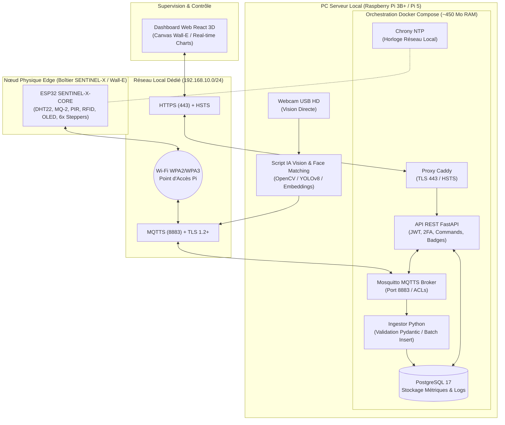

# 🗺️ Master Index & Carte du Projet — SENTINEL-X

Bienvenue dans le coffre de connaissances (Vault Obsidian) officiel du projet **SENTINEL-X : L'Avant-Poste Industriel du Futur**. 

Ce projet cyber-physique autonome a été conçu pour répondre aux défis d'infrastructures critiques isolées face aux menaces d'intrusion, cyberattaques et risques environnementaux (fuites de gaz, incendies).

> [!IMPORTANT]
> **Objectif 1 Mois :** Ce Vault récapitule l'ensemble du travail réalisé lors du Sprint initial de 4 jours et établit le plan de transformation vers une solution **industrielle, ultra-sécurisée et commerciale**.

---

## 🗂️ Navigation Rapide (Map of Content - MOC)

Pour naviguer efficacement dans la documentation, suivez les modules ci-dessous :

| N° | Document | Description | Tags |
| :--- | :--- | :--- | :--- |
| **01** | [[01 - 🔌 Architecture & Composants Matériels (IoT & Hardware)]] | Câblage ESP32, capteurs, 6 moteurs pas-à-pas, RFID, OLED, MCP23017, schéma KiCad & boîtier Fablab 3D. | `#hardware` `#esp32` `#iot` |
| **02** | [[02 - 🐳 Infrastructure Cloud-Edge & Stack Docker]] | Composition des microservices Docker (Mosquitto, Postgres, Ingestor, API, Caddy, Chrony NTP) et budget RAM Pi 3B+. | `#docker` `#infra` `#raspberrypi` |
| **03** | [[03 - 📡 Contrat de Communication MQTT & API REST]] | Contrat de données MQTT v2 (MQTTS 8883), schémas JSON, API REST FastAPI, authentification JWT & 2FA. | `#mqtt` `#api` `#fastapi` |
| **04** | [[04 - 🧠 Intelligence Artificielle (Vision & Analyse Prédictive)]] | Traitement vidéo OpenCV/YOLOv8-tiny, reconnaissance faciale dynamique & détection d'anomalies temporelles (Isolation Forest). | `#ia` `#opencv` `#yolo` `#machinelearning` |
| **05** | [[05 - 🛡️ Cybersécurité, Hardening & Pentest]] | Chiffrement TLS 1.2+ ECDSA, durcissement OS/UFW/iptables, conteneurs non-root read-only et pentest défensif/offensif. | `#security` `#cyber` `#hardening` `#tls` |
| **06** | [[06 - 💻 Interface de Supervision (Dashboard Web 3D)]] | Interface Web React 18, Vite, Three.js (Hologramme Wall-E 3D), graphiques temps réel et commandes réactives. | `#dashboard` `#react` `#threejs` |
| **07** | [[07 - 💡 Idées Améliorations & Nouvelles Fonctionnalités (Hardware & Infra)]] | **Catalogue exhaustif d'innovations matériel, réseau, IA et cybersécurité pour pousser le projet au sommet.** | `#innovations` `#roadmap` `#ideas` |
| **08** | [[08 - 📅 Roadmap & Plan d'Action 1 Mois]] | Planning détaillé sur 4 semaines pour exécuter les améliorations et valider le prototype industriel de niveau Enterprise. | `#planning` `#roadmap` `#sprint` |

---

## 📐 Vue d'Ensemble de l'Architecture Système

---

## 📌 Synthèse des Enjeux & Piliers Technologiques

> [!NOTE]
> Le projet s'articule autour de 4 piliers technologiques majeurs définis dans le cahier des charges national :
> 1. **IoT & Edge Computing** : Microcontrôleur autonome (ESP32), gestion cadencée des capteurs et actionneurs physiques.
> 2. **IA Locale & Prédictive** : Vision par ordinateur locale (sans cloud) et modèle Scikit-Learn sur séries temporelles.
> 3. **Infrastructure Résiliente** : Stack conteneurisée isolée sous Docker, budget RAM strict, auto-hébergement complet.
> 4. **Cybersécurité Avancée** : Isolation réseau, chiffrement de bout en bout, hardening du noyau/pare-feu et pentest.

---
*Document généré automatiquement pour Obsidian — Projet SENTINEL-X.*
