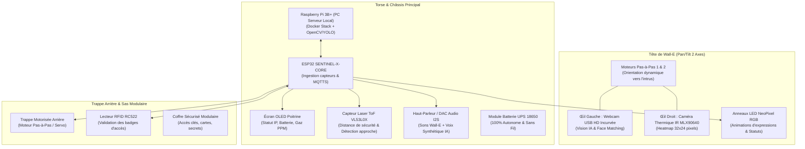

# 🔌 Architecture & Composants Matériels (Wall-E Sentinel Core)

Le boîtier physique du projet **SENTINEL-X** est matérialisé par le robot iconique **Wall-E**, réarmé et rétrofité pour servir d'avant-poste autonome cyber-physique pour AetherCorp. 

Toute l'électronique de calcul (PC Serveur Local Raspberry Pi 3B+), le microcontrôleur d'ingestion (ESP32), les capteurs, les moteurs de mouvement et le système de batterie sont **100% intégrés à l'intérieur du châssis 3D de Wall-E**.

---

## 🤖 1. Ergonomie Mécanique & Mobilité de Wall-E

---

## 🛠️ 2. Inventaire Complété des Composants Matériels

| Composant | Emplacement Wall-E | Rôle & Fonction | Interface / Broches | Budget Est. |
| :--- | :--- | :--- | :--- | :---: |
| **Raspberry Pi 3B+** | Entrailles de Wall-E | Serveur Docker local, API FastAPI, IA Vision YOLOv8 | Hôte Central | *Inclus* |
| **ESP32 NodeMCU** | Torse de Wall-E | Microcontrôleur IoT MQTTS, gestion temps réel | Wi-Fi / SPI / I2C / ADC | *Inclus* |
| **Webcam USB HD** | Lentille Œil Gauche | Vision directe, reconnaissance faciale, YOLO | USB direct Pi 3B+ | *Inclus* |
| **Caméra IR MLX90640** | Lentille Œil Droit | Vision thermique infrarouge, détection de chaleur | I2C (`0x33`) | ~25 - 35 € |
| **2x Anneaux NeoPixel RGB** | Contour des yeux | Expressions visuelles (Patrouille, Alerte, Badge) | GPIO 15 (WS2812B) | ~5 € |
| **Module Audio MAX98357A** | Châssis intérieur | Haut-parleur 3W : Voix IA + Bruits officiels Wall-E | I2S (BCLK, LRC, DIN) | ~4 € |
| **Capteur Laser VL53L0X** | Poitrine / Torse | Télémètre laser (ToF) : Détection d'approche < 1m | I2C (`0x29`) | ~4 € |
| **Module Battery UPS 18650** | Base de Wall-E | Alimentation 5V 3A continue (Zero câble au mur) | Micro-USB / I2C (INA219) | ~15 € |
| **Capteur Gaz MQ-2** | Prise d'air latérale | Détection fumées et gaz toxiques | Analogique GPIO 34 | *Inclus* |
| **Capteur DHT22** | Aération arrière | Mesure température (-40°C/+80°C) et humidité | Mono-fil GPIO 4 | *Inclus* |
| **Lecteur RFID RC522** | Flanc arrière / Trappe | Contrôle d'accès physique au sas de coffre | SPI | *Inclus* |
| **MCP23017 + 6x ULN2003** | Base motorisée | Pilote des moteurs tête, bras et trappe arrière | I2C (`0x20`) | *Inclus* |

---

## 🎭 3. Comportements Réactifs & Storytelling de Wall-E

1. **Mode Patrouille Nominale (Tout va bien)** :
   - Yeux NeoPixel cyan/bleu respirants.
   - Balayage doux de la tête de gauche à droite.
   - Émission du son discret de démarrage *"Ta-da!"*.

2. **Mode Détection Humaine & Tracking Visuel** :
   - La webcam dans l'œil gauche détecte un visage via YOLO.
   - La tête de Wall-E pivote mécaniquement pour **fixer la personne du regard** !
   - Anneaux luminescents passant au jaune fixe.

3. **Mode Validation d'Accès RFID / Trappe Arrière** :
   - Présentation du badge sur le flanc de Wall-E.
   - Si **Autorisé** : Son joyeux *"Wall-E!"*, NeoPixels vert clignotant, la **trappe arrière motorisée s'ouvre** pour donner accès au coffre fort.
   - Si **Refusé** : Son de rejet *"Uh-oh!"*, NeoPixels rouge stroboscopique, la trappe reste fermée.

4. **Mode Alerte d'Urgence (Gaz / Feu / Intrusion Inconnue)** :
   - Sirène d'alarme 85dB + Voix IA industrielle AetherCorp sur le haut-parleur.
   - Les bras de Wall-E se lèvent au maximum, la tête s'oriente vers le haut.
   - Fermeture automatique d'urgence de la trappe arrière et coupure des vannes.

---
*Documentation Matérielle Wall-E — Projet SENTINEL-X.*
