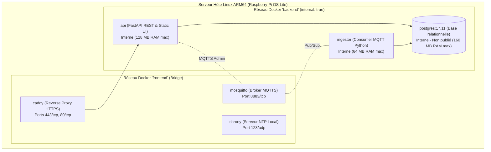
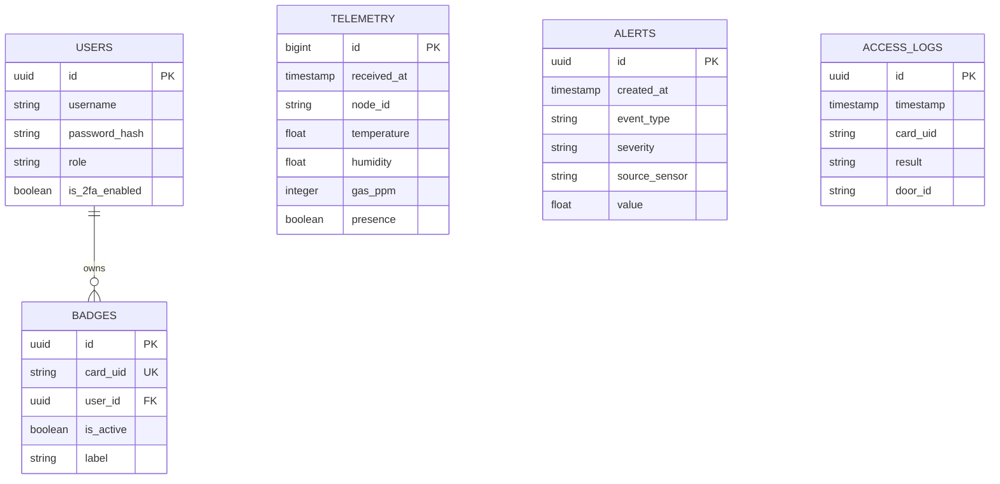

# 🐳 Infrastructure Cloud-Edge & Stack Docker

L'infrastructure du **PC Serveur Local** repose sur une stack conteneurisée **Docker Compose** ultra-légère, découpée en microservices isolés et dimensionnée pour fonctionner de manière résiliente sur un **Raspberry Pi 3 Model B+** (1 Go RAM, processeur quad-core ARM64) ou sur un Raspberry Pi 5.

> [!IMPORTANT]
> **Contrainte Mémoire Majeure :** Le budget RAM total alloué à la stack Docker Compose ne doit jamais dépasser **450 Mo**, afin de garantir une réserve mémoire suffisante (~500 Mo) pour l'exécution fluide du modèle de vision IA (YOLOv8 / OpenCV) sur l'hôte.

---

## 🏛️ Cartographie des Microservices Docker



---

## 📊 Matrice des Conteneurs & Budget RAM

| Service | Image Docker | Réseaux | Ports Publiés | Utilisateur (UID) | Limite RAM | Usage Mesuré |
| :--- | :--- | :--- | :--- | :--- | :--- | :--- |
| `mosquitto` | `eclipse-mosquitto:2.1.2-alpine` | `frontend`, `backend` | **8883/tcp** (MQTTS) | `1000` (PUID hôte) | 32 MB | **2.4 MB** |
| `postgres` | `postgres:17.11-alpine3.24` | `backend` | *Aucun (Isolé)* | `70` (postgres) | 160 MB | **23.0 MB** |
| `ingestor` | Build `./ingestor` (Python 3.13 Alpine) | `backend` | *Aucun (Isolé)* | `10001` (Non-root) | 64 MB | **25.0 MB** |
| `api` | Build `./api` (FastAPI + React bundle) | `backend` | *Aucun (Isolé)* | `10002` (Non-root) | 128 MB | **44.0 MB** |
| `proxy` | `caddy:2.10-alpine` | `frontend`, `backend` | **443/tcp**, **80/tcp** | `1000` (PUID hôte) | 48 MB | **14.0 MB** |
| `ntp` | Build `./chrony` (Chrony Alpine) | `frontend` | **123/udp** | `chrony` | 16 MB | **3.0 MB** |
| **TOTAL** | — | — | **8883, 443, 80, 123** | — | **384 MB** | **≈ 111.4 MB** |

---

## 🔒 Isolation Réseau & Règles de Publication

1. **Réseau `backend` (`internal: true`)** :
   - Strictement aucun accès vers l'extérieur (pas de passerelle Internet par défaut).
   - PostgreSQL est accessible uniquement par l'API et l'Ingestor. Il n'a **aucun port publié** sur la machine hôte.
2. **Réseau `frontend`** :
   - Seuls deux flux d'entrée réseau sont ouverts vers l'extérieur sur `wlan0` (192.168.10.0/24) :
     - **Port 8883/tcp** : Trafic MQTT sécurisé sur TLS 1.2+ (MQTTS). Le port MQTT 1883 en clair est totalement absent.
     - **Port 443/tcp** : Trafic HTTPS chiffré vers le Reverse Proxy Caddy.
     - **Port 123/udp** : Synchronisation NTP pour l'ESP32.

---

## 🛠️ Scripts d'Administration & Déploiement Idempotents

Le dossier `scripts/` contient les outils d'automatisation d'infrastructure :

```bash
# 1. Préparation du système Pi (zram, journald en RAM, cgroups mémoire)
sudo ./scripts/setup-pi.sh

# 2. Génération automatique des secrets et mots de passe aléatoires 32 caractères (.env)
./scripts/gen-env.sh

# 3. Génération de la CA interne & certificats ECDSA P-256 TLS 1.2+
./scripts/gen-certs.sh

# 4. Lancement de la stack Docker Compose
docker compose up -d --build

# 5. Exécution du banc de tests automatisé (32 vérifications de bout en bout)
./scripts/smoke-test.sh

# 6. Application du durcissement OS & Pare-feu UFW / DOCKER-USER
sudo ./scripts/harden-host.sh
```

---

## 🗄️ Schéma de Base de Données PostgreSQL (`db/init.sql`)

La base de données relationnelle est structurée pour gérer l'historique de télémétrie, la journalisation des alertes et les habilitations RFID / Visages :



---
*Documentation Infrastructure — Projet SENTINEL-X.*
