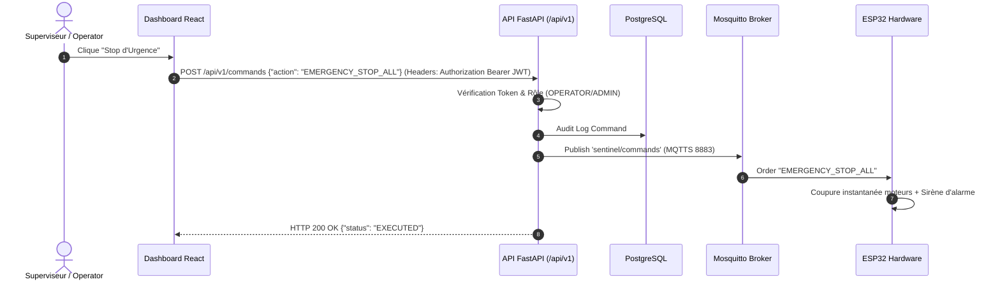

# 📡 Contrat de Communication MQTT & API REST

Ce document constitue la **source de vérité absolue** des spécifications d'échange de données entre le module microcontrôleur ESP32, l'ingestor Python, l'API REST FastAPI, le script de vision IA et le Dashboard Web.

---

## 🛰️ 1. Contrat MQTT v2 (Broker MQTTS Port 8883)

Tous les échanges MQTT s'effectuent sur le réseau local Wi-Fi via un canal chiffré **TLS 1.2+ (MQTTS)** sur le port 8883.

### Matrice d'Accès & Matrice des Topics MQTT

| Topic MQTT | Direction | QoS | Fréquence | Producteur | Consommateur | Rôle / Description |
| :--- | :--- | :---: | :--- | :--- | :--- | :--- |
| `sentinel/telemetry` | ESP32 ➔ Serveur | 0 | Toutes les 2s | `esp32` | `ingestor` | Métriques brutes capteurs (temp, hum, gaz, PIR) |
| `sentinel/alerts` | ESP32 ➔ Serveur | 1 | Événementiel | `esp32` | `ingestor` | Alertes immédiates issues du microcontrôleur |
| `sentinel/access` | ESP32 ➔ Serveur | 1 | Sur passage badge | `esp32` | `api` | Demande de validation RFID (UID du badge) |
| `sentinel/access/response` | Serveur ➔ ESP32 | 1 | Réponse immédiate | `api` | `esp32` | Décision d'accès (Autorisé/Refusé + commande sas) |
| `sentinel/commands` | Serveur ➔ ESP32 | 1 | Ordre manuel/IA | `api` | `esp32` | Exécution d'ordres (Moteurs, Buzzer, Stop Urgence) |
| `sentinel/vision/events` | IA ➔ Serveur | 1 | Sur détection | `vision` | `ingestor` | Alertes de détection humaine / intrus par IA |
| `sentinel/enroll` | ESP32 ➔ Serveur | 0 | Mode enrôlement | `esp32` | `api` | Capture d'un nouveau badge RFID à attribuer |

---

## 📝 2. Exemples de Payloads JSON MQTT

### 2.1 Télémétrie (`sentinel/telemetry`)
```json
{
  "node_id": "SENTINEL-X-CORE",
  "timestamp": 1728132000,
  "uptime_ms": 142580,
  "metrics": {
    "temperature_celsius": 23.4,
    "humidity_percent": 48.0,
    "gas_raw_ppm": 215,
    "presence_detected": false
  },
  "actuators_state": {
    "airlock_open": false,
    "gas_valve_open": true,
    "ventilation_active": false,
    "barrier_open": false,
    "alarm_active": false
  },
  "system": {
    "wifi_rssi_dbm": -58,
    "free_heap_bytes": 194200
  }
}
```

### 2.2 Demande d'Accès RFID (`sentinel/access`)
```json
{
  "node_id": "SENTINEL-X-CORE",
  "card_uid": "A3:5F:B2:1C",
  "door_id": "AIRLOCK_MAIN"
}
```

### 2.3 Réponse d'Accès Serveur (`sentinel/access/response`)
```json
{
  "card_uid": "A3:5F:B2:1C",
  "granted": true,
  "user_name": "Ingénieur Matis",
  "action": "OPEN_AIRLOCK",
  "ttl_seconds": 5
}
```

### 2.4 Commandes d'Actionneurs (`sentinel/commands`)
```json
{
  "action": "EMERGENCY_STOP_ALL",
  "issuer": "ADMIN_OPERATOR",
  "timestamp": 1728132050
}
```

---

## 🌐 3. Spécifications de l'API REST FastAPI

L'API REST est documentée dynamiquement via OpenAPI / Swagger (`https://192.168.10.1/docs`).

### Principaux Endpoints & Contrats d'API



| Méthode | Route API | Rôle & Description | Protection |
| :--- | :--- | :--- | :--- |
| `POST` | `/api/v1/auth/login` | Authentification utilisateur & génération Token JWT | Public (Rate-limited) |
| `POST` | `/api/v1/auth/2fa/verify` | Validation du code OTP 2FA | JWT Partiel |
| `GET` | `/api/v1/telemetry/latest` | Récupération des dernières métriques capteurs | Bearer JWT |
| `GET` | `/api/v1/telemetry/history` | Historique des séries temporelles (graphiques) | Bearer JWT |
| `GET` | `/api/v1/alerts` | Liste des alertes de sécurité triées par sévérité | Bearer JWT |
| `POST` | `/api/v1/alerts` | Injection d'une alerte manuelle ou par jeton d'appareil | Device Token / JWT |
| `POST` | `/api/v1/commands` | Envoi d'ordres physiques aux actionneurs ESP32 | Bearer JWT (Role Operator) |
| `GET` | `/api/v1/badges` | Gestion des cartes RFID autorisées | Bearer JWT (Admin) |
| `POST` | `/api/v1/faces/enroll` | Enrôlement d'une empreinte faciale (Embeddings 128D) | Bearer JWT (Admin) |
| `GET` | `/api/v1/security/audit-logs` | Journal d'audit de cybersécurité non modifiable | Bearer JWT (Admin) |

---
*Spécification du Contrat d'Échange — Projet SENTINEL-X.*
