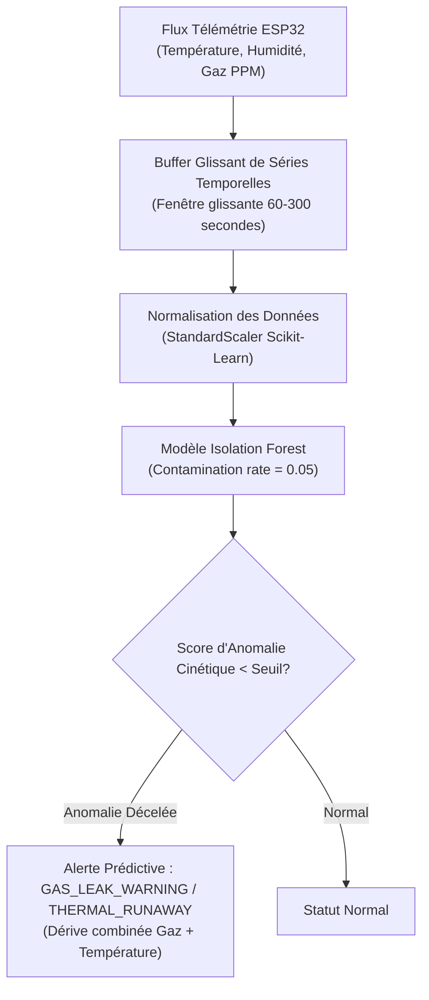

# 🧠 Intelligence Artificielle (Vision & Analyse Prédictive)

Le projet **SENTINEL-X** embarque une double brique d'Intelligence Artificielle Locale s'exécutant directement sur le PC Serveur Local (sans dépendance vers aucun service Cloud externe), conformément aux strictes exigences de souveraineté et de sécurité AetherCorp.

---

## 👁️ 1. Module de Vision Intelligente & Reconnaissance Faciale

Le sous-système de vision (`sentinel_x/ai/`) intercepte le flux vidéo brut issu de la webcam USB connectée directement au PC Serveur.

```mermaid
flowchart LR
    CAM["Webcam USB HD<br/>(Stream Vidéo Brut)"] --> RESIZE["Redimensionnement 640x480<br/>(< 100ms par trame)"]
    RESIZE --> YOLO["Modèle YOLOv8-tiny<br/>(Détection de présence humaine)"]
    
    YOLO -->|Intrus Détecté| FACE["Extracteur d'Empreintes Faciales<br/>(Embeddings 128D)"]
    FACE --> MATCH{"Match Base Visages Autorisés?"}
    
    MATCH -->|Oui (Autorisé)| PASS["Événement 'Authorized Person'<br/>Affichage HUD Vert"]
    MATCH -->|Non (Inconnu)| ALERT["Alerte INTRUSION_DETECTED<br/>Publication MQTTS + Capture Snapshot"]
    
    PASS & ALERT --> STREAM["MJPEG HTTP Stream<br/>Incrustation HUD Live Dashboard"]
```

### Caractéristiques Techniques de la Vision
* **Optimisation des Flux** : Compression et bridage systématique en résolution **640x480 pixels à 15-20 FPS** pour garantir un temps d'inférence strict inférieur à 100 ms sur CPU.
* **Modèle d'Inférence** : **YOLOv8-tiny** (quantifié en INT8 / ONNX Runtime) permettant d'isoler en temps réel les silhouettes humaines dans le champ de vision du boîtier.
* **Reconnaissance Faciale (`face_matcher.py`)** :
  - Extraction de vecteurs de caractéristiques à 128 dimensions pour chaque visage détecté.
  - Calcul de la distance euclidienne par rapport à la base d'empreintes autorisées (`authorized_faces.py`).
  - Tolérance de concordance paramétrable (Seuil de distance d'exposition ≤ 0.55).
* **Déclenchement d'Alertes (`unknown_alert.py`)** :
  - Publication immédiate sur `sentinel/vision/events` avec payload JSON enrichi (bounding box, score de confiance, timestamp, image encodée en Base64).

---

## 📈 2. Maintenance Prédictive sur Séries Temporelles (`anomaly.py`)

Conformément aux directives de l'épreuve national EPSI BAC+4, l'analyse comportementale interdit l'usage de simples règles statiques (`if temp > 40`). Elle repose sur un modèle d'apprentissage automatique d'analyse de corrélation temporelle.



### Fonctionnement de l'Algorithme Isolation Forest
1. **Apprentissage du Régime Nominal** :
   - Le modèle apprend le comportement baseline des corrélations entre la hausse progressive de température et la micro-déviation de la valeur brute du capteur MQ-2.
2. **Détection Précoce** :
   - L'algorithme isole une anomalie cinétique **avant même d'atteindre le seuil critique d'alarme physique**, permettant une intervention préventive de la ventilation ou l'isolation d'une conduite de gaz.

---
*Documentation IA & Vision — Projet SENTINEL-X.*
