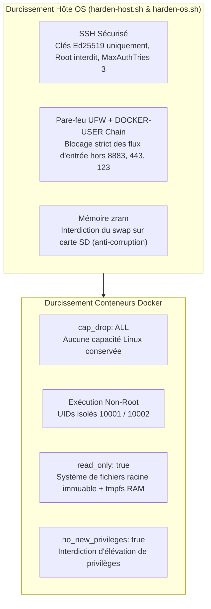

# 🛡️ Cybersécurité, Hardening & Pentest

La cybersécurité défensive et l'audit offensif constituent un pilier majeur de la mission **SENTINEL-X**. L'infrastructure a été conçue selon le principe de **Défense en Profondeur (Defense in Depth)** et de **Zero-Trust** pour résister aux tentatives d'usurpation, d'interception réseau et de déni de service lors de l'épreuve du Pentest croisé.

---

## 🔒 1. Chiffrement & Sécurité des Transports

| Composant | Protocole & Standard | Chiffrement & Algorithmes | Validation / Certificats |
| :--- | :--- | :--- | :--- |
| **MQTT IoT (ESP32 ↔ Broker)** | **MQTTS (8883/tcp)** | TLS 1.2 / TLS 1.3 (ECDHE-ECDSA) | Certificat serveur **ECDSA P-256** signé par la CA interne |
| **Dashboard / API Web** | **HTTPS (443/tcp)** | TLS 1.2+ / HSTS / Perfect Forward Secrecy | Certificat SSL auto-généré Caddy, HTTP-to-HTTPS redirect |
| **Mots de Passe Broker** | PBKDF2-SHA512 | `mosquitto_passwd -U` | Stockage haché strict sans aucun mot de passe en clair |
| **Mots de Passe API** | Bcrypt / Argon2id | Sel dynamique + hachage résistant au GPU | Complété par authentification 2FA TOTP (Google Auth) |

---

## 🛡️ 2. Durcissement Système & Conteneurs (Hardening)



### Directives d'Isolation Docker (`docker-compose.yml`)
* `read_only: true` : empoche les modifications malveillantes de fichiers exécutables.
* `cap_drop: [ALL]` : supprime toutes les capacités privilège du noyau Linux.
* `security_opt: ["no-new-privileges:true"]` : empêche toute tentative d'injection SUID.
* `tmpfs: /tmp` : redirige l'écriture temporaire en RAM non persistante.

---

## ⚔️ 3. Audit Offensif & Résistance au Pentest

Le script automatisé `scripts/audit-security.sh` et les tests de pénétration simulent les vecteurs d'attaque réels menés par des groupes d'infiltrés :

```bash
# Lancement de l'audit complet de vulnérabilité
./scripts/audit-security.sh
```

### Scénarios d'Attaque Évalués & Remédiations

| Vecteur d'Attaque | Technique de Test | Comportement Attendu & Protection | Statut |
| :--- | :--- | :--- | :---: |
| **Attaque Man-in-the-Middle (MitM)** | Interception ARP & Sniffing Wireshark | Impossible : Flux 100% chiffrés sous MQTTS/TLS 1.2 avec vérification de la CA. | ✅ PROTÉGÉ |
| **Attaque par Déni de Service (DoS)** | Inundation de trames MQTT / HTTP Flood | Bloqué : Limitation de débit (Rate-limiting API), files d'attente Mosquitto bornées. | ✅ PROTÉGÉ |
| **Injection de Payloads SQL/NoSQL** | Payload fuzzer sur endpoints API | Neutralisé : Utilisation exclusive de Requêtes Préparées & ORM SQLAlchemy. | ✅ PROTÉGÉ |
| **Contournement du Pare-feu Docker** | Tentative d'accès direct au port 5432 PostgreSQL | Échec : Port 5432 non exposé, règles d'isolation strictes dans la chaîne `DOCKER-USER`. | ✅ PROTÉGÉ |
| **Brute-force Mots de Passe SSH** | Tentatives répétées Nmap / Hydra | Rejeté : Auth par mot de passe désactivée (`PasswordAuthentication no`), ban automatique. | ✅ PROTÉGÉ |

---
*Documentation Cybersécurité — Projet SENTINEL-X.*
