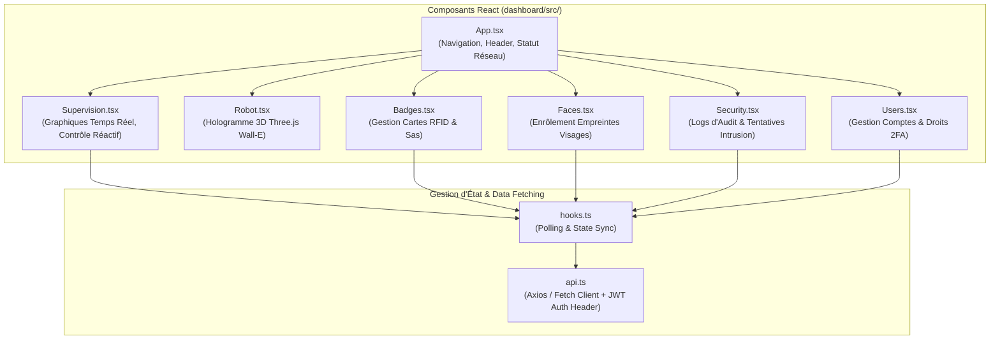

# 💻 Interface de Supervision (Dashboard Web 3D)

Le **Dashboard de Supervision React** constitue le centre de commandement tactique du projet **SENTINEL-X**. Hébergé et servi directement par l'API FastAPI derrière le Proxy Caddy, il offre une interface temps réel, dynamique et ultra-réactive pour les opérateurs sur le terrain.

---

## 🎨 1. Architecture Frontend & Stack Technique

* **Framework Core** : React 18 + TypeScript + Vite.
* **Moteur 3D Holographique** : **Three.js** / React Three Fiber (`dashboard/src/Robot.tsx`) affichant une représentation 3D interactive du robot Wall-E / Boîtier Sentinel-X avec indicateurs LED réactifs.
* **Design & Stylisme** : Vanilla CSS modulaire (`styles.css`), thèmes sombres cybernétiques (Dark Mode), Glassmorphism, animations fluides à 60 FPS.
* **Visualisation de Données** : Recharts / Chart.js pour le traçage en direct des séries temporelles (température, humidité, PPM gaz).

---

## 🕹️ 2. Fonctionnalités Clés du Dashboard

### A. Panneau de Supervision Temps Réel (`Supervision.tsx`)
- **Widgets de Capteurs** : Jauges de température (°C), niveau d'humidité (%), valeur brute PPM de gaz et statut PIR.
- **Affichage Vidéo Direct** : Retransmission en direct du flux vidéo USB avec superposition HUD (Bounding boxes YOLO, détection d'intrus, statut vert/rouge).
- **Panneau d'Actionneurs Réactifs** : Boutons de commande manuelle pour :
  * Déclencher / Interrompre l'alarme sonore (Buzzer piézo).
  * Activer / Fermer la vanne d'isolement de gaz (Moteur pas-à-pas 2).
  * Déclencher la ventilation forcée d'urgence (Moteur pas-à-pas 4).
  * **Arrêt d'Urgence Global (`EMERGENCY_STOP_ALL`)**.

### B. Hologramme 3D Interactif (`Robot.tsx`)
- Modèle 3D temps réel s'orientant et changeant de couleur (LEDs d'yeux et d'état) en fonction des messages MQTT reçus de l'ESP32.
- Animation lors des ouvertures de sas ou des alertes d'intrusion.

### C. Enrôlement & Sécurité (`Badges.tsx`, `Faces.tsx`, `Security.tsx`)
- **RFID Manager** : Attribution instantanée des badges scannés par le RC522 aux opérateurs enregistrés.
- **Biométrie Visage** : Capture de photos via webcam pour générer et enregistrer les vecteurs d'empreintes faciales.
- **Audit Cyber** : Inspection visuelle des tentatives de connexion échouées, blocages d'IP et détections d'anomalies.

---
*Documentation Dashboard Web — Projet SENTINEL-X.*
