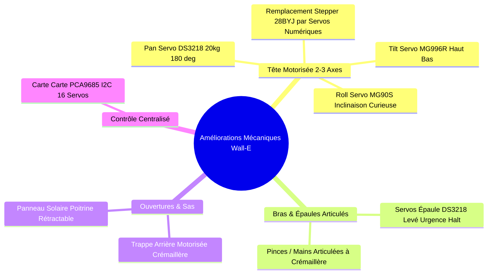

# 💡 Catalogue des Améliorations & Innovations (Wall-E Edition)

Ce document rassemble et répertorie **l'ensemble des idées d'améliorations matérielles, mécaniques, électroniques, logicielles et de storytelling** pour faire du boîtier **Wall-E** un prototype d'exception capable de remporter la compétition nationale.

> [!NOTE]
> **Faisabilité & Budget :** Toutes les idées ci-dessous sont triées par catégorie technologique, avec leur niveau de priorité, leur budget estimé et leur impact visuel auprès du jury.

---

## 🗂️ Sommaire des Catégories

1. [[#⚙️ 1. Mécanique & Motorisation du Robot (Châssis Wall-E)]]
2. [[#🔌 2. Capteurs, Optique & Électronique Embarquée]]
3. [[#🔊 3. Système Audio & Storytelling Interactif]]
4. [[#🧠 4. Intelligence Artificielle & Vision Asservie]]
5. [[#🐳 5. Infrastructure, Réseau & Dashboard Web]]
6. [[#🛒 6. Tableau Récapitulatif des Composants & Budget]]

---

## ⚙️ 1. Mécanique & Motorisation du Robot (Châssis Wall-E)

### 1.1 Remplacement du Moteur de Tête (Adieu le lent 28BYJ-48)
* **Problème** : Le moteur pas-à-pas 28BYJ-48 actuel tourne beaucoup trop lentement (~15 tr/min) pour faire du suivi visuel réactif.
* **Solution** : Passer sur un cou motorisé par **Servomoteurs Numériques Haut Couple** :
  1. **Axe Pan (Rotation Gauche/Droite 180°)** : Servo numérique **DS3218 (20 kg.cm)**. Vitesse de rotation ultra-rapide (**0,14s / 60°**) pour suivre instantanément les déplacements d'une personne dans la pièce.
  2. **Axe Tilt (Inclinaison Haut/Bas 90°)** : Servo **MG996R**. Permet à Wall-E de lever les yeux vers le jury ou de regarder au sol.
  3. **Axe Roll (Inclinaison Curieuse de Côté ±20°)** : Micro-servo **MG90S Métal**. Permet à Wall-E de **pencher la tête d'un air curieux** (comme dans le film) lorsqu'il scanne un badge ou ne comprend pas une instruction.

### 1.2 Articulation des Épaules & Bras (Servos vs Steppers)
* **Choix Technique** : Les servomoteurs sont **100% supérieurs aux moteurs pas-à-pas** pour les bras (gain de poids, pas de chauffe à l'arrêt, position absolue garantie).
* **Épaule (Levée du bras)** : Servos numériques **DS3218 (20 kg.cm)**. Permettent de lever les bras très haut en position d'alerte *"Halt!"*.
* **Poignet / Pince Articulée** : Pinces 3D entrainées par micro-servo pour pouvoir **tendre ou saisir un badge physique** lors de la démonstration.

### 1.3 Trappe Arrière Motorisée (Sas d'Accès Physique RFID)
* **Mécanisme** : Trappe d'accès arrière coulissante avec mécanisme à crémaillère imprimé en 3D, entraînée par un servo **MG996R**.
* **Comportement** : Lorsqu'un badge RFID est autorisé par la base PostgreSQL, Wall-E émet un bip joyeux et la trappe glisse doucement pour donner accès au coffre fort physique.

### 1.4 Panneau Avant Rétractable (Poitrine)
* **Mécanisme** : Panneau basculant dissimulant l'écran OLED 1.3", le bouton d'arrêt d'urgence coup de poing rouge et un port d'injection USB de maintenance.

### 1.5 Pilote de Servomoteurs Centralisé PCA9685 (I2C)
* **Composant** : Carte PCA9685 (~4 €) connectée en I2C sur l'ESP32.
* **Bénéfice** : Permet de piloter jusqu'à **16 servomoteurs indépendants avec 2 seuls fils I2C (SDA/SCL)** et sans surcharger le processeur du microcontrôleur.

---

## 🔌 2. Capteurs, Optique & Électronique Embarquée

### 2.1 Double Vision "Predator" (Lentille Gauche + Droite)
* **Œil Gauche** : Webcam USB HD intégrée dans la lentille (Vision couleur normale, YOLOv8 inférence et reconnaissance faciale).
* **Œil Droit** : Matrice Thermique Infra-Rouge **MLX90640** (32x24 pixels I2C ~25 €).
* **Impact** : Le Dashboard affiche un flux vidéo hybride avec le contour des visages et leur température corporelle en surbrillance.

### 2.2 Anneaux Lumineux d'Expressions NeoPixel (Autour des Yeux)
* **Configuration** : 2 anneaux NeoPixel WS2812B de 12 LEDs encerclant les lentilles des yeux avec masque dépoli acrylique (effet néon continu).
* **Code Couleur & Animations** :
  - *Cyan Pulsion* = Mode Patrouille nominale.
  - *Jaune Rotation* = Analyse faciale / Lecture de badge.
  - *Vert Fixe* = Accès accordé.
  - *Rouge Stroboscopique (10 Hz)* = Alerte d'intrusion ou fuite de gaz.

### 2.3 Télémètre Laser de Proximité ToF VL53L0X (Poitrine)
* **Composant** : Capteur laser Time-of-Flight I2C (~4 €) placé sur la poitrine.
* **Fonction** : Mesure de distance précise au millimètre près. Si un juré s'approche à moins de 30 cm de Wall-E, le robot recule la tête et lève les bras d'un geste de protection.

### 2.4 Batterie UPS Li-Ion 18650 (Wall-E 100% Autonome & Sans Fil)
* **Composant** : Module Battery UPS 18650 (5V 3A ~15 €) alimentant le Raspberry Pi 3B+ et l'ESP32.
* **Impact** : Wall-E est posé au centre de la table **sans aucun câble d'alimentation branché au mur**, 100% autonome sur batterie et Wi-Fi.

---

## 🔊 3. Système Audio & Storytelling Interactif

### 3.1 Carte Sound DAC Audio I2S (MAX98357A) + Enceinte 3W
* **Composant** : DAC I2S numérique MAX98357A (~4 €) + petit haut-parleur 3W inséré dans une caisse de résonance 3D à l'intérieur du torse.
* **Bi-Mode Sonore** :
  - **Bruitages Officiels Wall-E** (*"Ta-da!", "Wall-E!", "EVE?", "Uh-oh!"*) lors des événements quotidiens (boot, badge scanné, détection).
  - **Voix IA Synthétique AetherCorp** lors des urgences majeures (*"Alerte critique AetherCorp. Fuite de gaz détectée. Fermeture des vannes !"*).

---

## 🧠 4. Intelligence Artificielle & Vision Asservie

### 4.1 Suivi du Regard en Temps Réel ("Wall-E Cyber-Gaze")
* **Principe** : Le script Python de vision calcule le centre ($x, y$) du visage détecté par rapport au centre de l'image (320, 240).
* **Asservissement** : Si la personne se déplace vers la droite, le serveur envoie un ordre MQTT à l'ESP32 pour faire pivoter le servo de tête vers la droite. **Wall-E vous regarde en permanence dans les yeux !**

---

## 🐳 5. Infrastructure, Réseau & Dashboard Web

### 5.1 Push WebSockets / Server-Sent Events (SSE)
* Remplacement du polling HTTP sur le Dashboard par un flux SSE persistant. Latence d'affichage **< 5 ms**.

### 5.2 Rédundance Bi-Serveur High-Availability (Keepalived VRRP)
* Basculement automatique en moins de 2 secondes sur un deuxième Raspberry Pi miroir en cas de défaillance matérielle.

### 5.3 Mises à Jour OTA MQTTS (Firmware à Distance)
* Recompilation et flashage chiffré du microcontrôleur ESP32 à distance sans câble USB.

---

## 🛒 6. Tableau Récapitulatif des Composants & Budget

| Composant | Quantité | Prix Approx. | Priorité | Impact Jury |
| :--- | :---: | :---: | :---: | :---: |
| **Servo Numérique DS3218 (20 kg.cm)** (Tête Pan) | 1 | ~12 € | 🔥 HAUTE | ⭐⭐⭐⭐⭐ *Suivi de regard ultra rapide* |
| **Servo Métal MG996R** (Tête Tilt / Trappe) | 2 | ~10 € | 🔥 HAUTE | ⭐⭐⭐⭐⭐ *Mouvements robustes* |
| **Micro-Servos MG90S Métal** (Roll Tête / Bras) | 2 | ~6 € | 🟡 MOYENNE | ⭐⭐⭐⭐ *Inclinasion curieuse de la tête* |
| **Carte PCA9685 I2C 16 Servos** | 1 | ~4 € | 🔥 HAUTE | ⭐⭐⭐⭐⭐ *Câblage propre 2 fils I2C* |
| **Matrice Thermique IR MLX90640** | 1 | ~25 € | 🟡 MOYENNE | ⭐⭐⭐⭐⭐ *Double vision Predator* |
| **2x Anneaux NeoPixel RGB (12 LEDs)** | 1 | ~5 € | 🔥 HAUTE | ⭐⭐⭐⭐⭐ *Expressions visuelles des yeux* |
| **DAC Audio I2S MAX98357A + HP 3W** | 1 | ~6 € | 🔥 HAUTE | ⭐⭐⭐⭐⭐ *Voix IA + Bruits Wall-E* |
| **Module Battery UPS 18650 (5V 3A)** | 1 | ~15 € | 🟡 MOYENNE | ⭐⭐⭐⭐ *Wall-E 100% sans fil* |
| **Capteur Laser ToF VL53L0X** | 1 | ~4 € | 🟢 OPTION | ⭐⭐⭐ *Détection d'approche* |

---
*Catalogue exhaustif trié des innovations Wall-E — Projet SENTINEL-X.*
