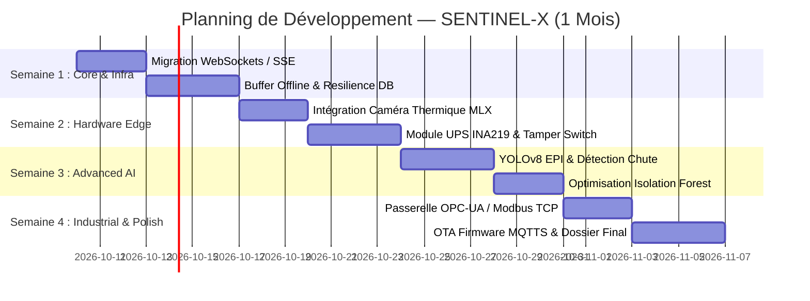

# 📅 Roadmap & Plan d'Action 1 Mois

Pour amener le prototype **SENTINEL-X** au sommet de ses capacités techniques et remporter la compétition nationale, voici la planification stratégique structurée sur **4 semaines (30 jours)**.

---

## 🗓️ Calendrier d'Exécution Synthétique

---

## 📋 Détail Semaine par Semaine

### 🔹 Semaine 1 (Jours 1 à 7) : Stabilisation, WebSockets & Résilience Cloud-Edge
* **Objectif** : Supprimer le polling HTTP, accélérer le Dashboard et sécuriser la rétention locale de données.
* **Livrables** :
  1. Implémenter un endpoint **WebSockets / Server-Sent Events (SSE)** dans FastAPI (`/api/v1/ws/live`).
  2. Mettre à jour le Dashboard React pour consommer le flux SSE (mise à jour jauges < 5ms).
  3. Ajouter un mécanisme de **stockage tampon SQLite offline** sur l'ESP32 / Ingestor en cas de déconnexion réseau provisoire.
  4. Réaliser des benchmarks d'utilisation mémoire sous charge (Objectif RAM < 450 Mo maintenu).

### 🔹 Semaine 2 (Jours 8 à 15) : Extensions Matérielles, Énergie & Anti-Sabotage
* **Objectif** : Rendre le boîtier physique intelligent face aux pannes d'énergie et attaques physiques.
* **Livrables** :
  1. Câbler et intégrer le capteur thermique **MLX90640** (I2C) sur l'ESP32 / Pi.
  2. Générer une superposition de carte de chaleur (Heatmap) dans le Dashboard React 3D.
  3. Installer le contrôleur de courant **INA219** et la batterie Li-ion 18650 (Autonomie 6h).
  4. Implémenter le micro-rupteur anti-tamper avec alerte d'effraction et effacement des clés RAM.

### 🔹 Semaine 3 (Jours 16 à 22) : Vision IA Avancée, EPI & Détection de Chutes
* **Objectif** : Étendre les fonctionnalités de l'IA locale pour répondre aux exigences de sécurité du travail.
* **Livrables** :
  1. Entraîner/Quantifier un modèle **YOLOv8-Pose** pour détecter la perte d'équilibre / chute d'agent (Man-Down).
  2. Ajouter le module de détection d'Équipements de Protection Individuelle (Casque de chantier + Gilet).
  3. Pré-entraîner le modèle **Isolation Forest** avec des jeux de données de fuite de gaz lentes pour affiner les alertes prédictives.

### 🔹 Semaine 4 (Jours 23 à 30) : Interopérabilité Industrielle, OTA & Rendu Final
* **Objectif** : Connecter le système aux réseaux SCADA d'usine et finaliser l'ensemble des livrables de soutenance.
* **Livrables** :
  1. Exposer les métriques sur une passerelle **OPC-UA / Modbus TCP** pour démonstration avec un automate industriel.
  2. Déployer la mise à jour **OTA (Over-The-Air)** chiffrée du micrologiciel ESP32 via MQTT.
  3. Tourner la vidéo promotionnelle 60s au format vertical ("Sentinel Drop").
  4. Générer le Rapport d'Ingénierie Technique final au format PDF.

---
*Roadmap d'Exécution 30 Jours — Projet SENTINEL-X.*
